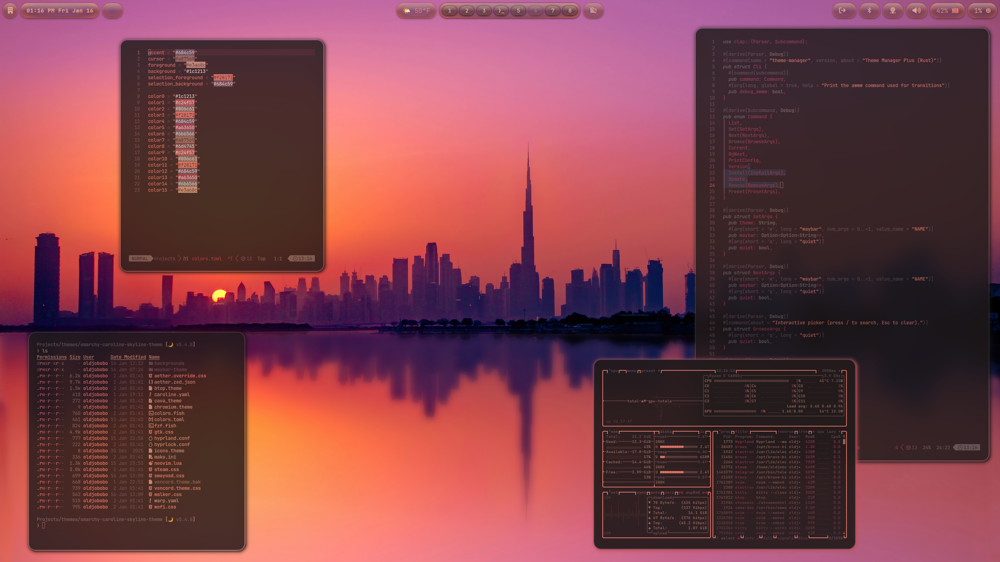

# Omarchy REDDCS

A dark, warm-toned theme for [Omarchy](https://github.com/omarchy/omarchy) — covering Hyprland, terminals, bars, launchers, and system apps.

## Preview



## Install

Use the Omarchy theme installer:

```bash
omarchy theme install https://github.com/cleitontrails/omarchy-reddcs-theme
```

## What's included

- **Palette**: terminal palette (`colors.toml`), base16 source (`caroline.yaml`)
- **Hyprland**: rules and opacity tuning (`hyprland.conf`), lock screen styling (`hyprlock.conf`)
- **Waybar**: bar styling (`waybar.css`)
- **Terminals**: Kitty (`kitty.conf`), Alacritty (`alacritty.toml`), Ghostty (`ghostty.conf`)
- **Walker**: launcher styling (`walker.css`)
- **System tools**: btop (`btop.theme`), Mako (`mako.ini`), SwayOSD (`swayosd.css`)
- **Editors/UI**: Neovim (`neovim.lua`), VS Code (`vscode.json`), icons pointer (`icons.theme`)

## Credits

This theme is a fork of [LINUX-OMARCHY-REDDCS](https://github.com/mohamedredachakir/LINUX-OMARCHY-REDDCS), created by **[mohamedredachakir](https://github.com/mohamedredachakir)**.

The base16 palette is derived from [caroline](https://codeberg.org/ed/), authored by **ed**.